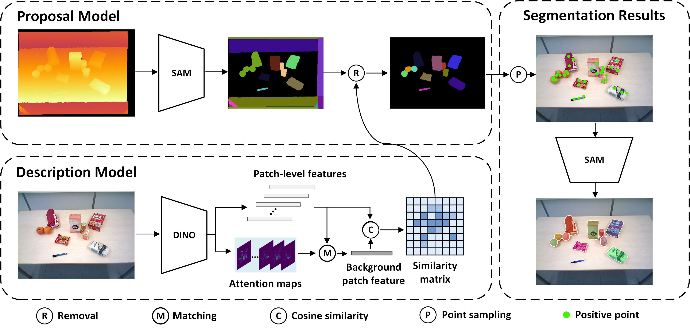
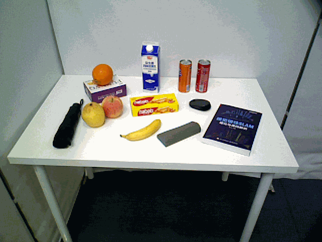
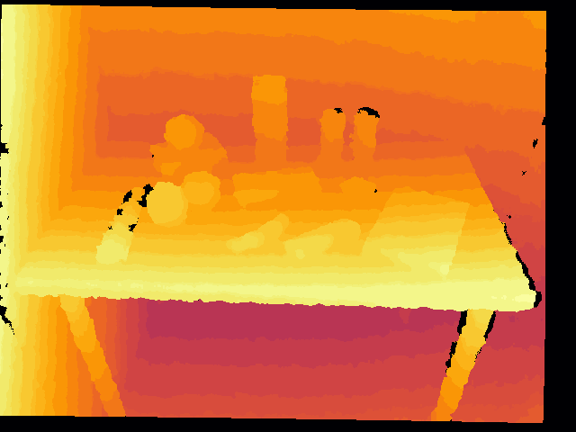
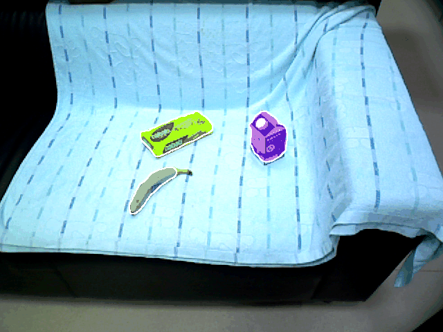

# ZISVFM: Zero-Shot Object Instance Segmentation in Indoor Robotic Environments with Vision Foundation Models

## Abstract
Service robots operating in unstructured environments must effectively recognize and segment unknown objects
to enhance their functionality. Traditional supervised learningbased segmentation techniques require extensive annotated
datasets, which are impractical for the diversity of objects
encountered in real-world scenarios. Unseen Object Instance
Segmentation (UOIS) methods aim to address this by training
models on synthetic data to generalize to novel objects, but
they often suffer from the simulation-to-reality gap. This paper
proposes a novel approach (ZISVFM) for solving UOIS by leveraging the powerful zero-shot capability of the segment anything
model (SAM) and explicit visual representations from a selfsupervised vision transformer (ViT). The proposed framework
operates in three stages: (1) generating object-agnostic mask
proposals from colorized depth images using SAM, (2) refining
these proposals using attention-based features from the selfsupervised ViT to filter non-object masks, and (3) applying
K-Medoids clustering to generate point prompts that guide
SAM towards precise object segmentation. Experimental validation on two benchmark datasets and a self-collected dataset
demonstrates ZISVFM’s superior performance in complex environments, including hierarchical settings such as cabinets,
drawers, and handheld objects. 

## Method Overview

Overview of the proposed methodology. This approach employs two vision foundation models: SAM for segmentation and ViT, trained with DINO, for feature description in a scene. The process consists of three main stages: 1) Generating object-agnostic mask proposals using SAM on colorized depth images; 2) Refinement of object masks by removing non-object masks based on explicit visual representations from a self-supervised ViT; 3) Point prompts derived from clustering centres within each object's proposal further optimise object segmentation performance.

## Installation
To install and run this project using a Conda environment, follow these steps:
1. **Clone the Repository**
   ```bash
   git clone https://github.com/Yinmlmaoliang/zisvfm.git
   cd zifvfm
   ```
2. **Create and Activate a Conda Environment**
   ```bash
   conda create --name zisvfm python=3.9  # Replace 'myenv' with your preferred env name
   conda activate zisvfm
   ```
3. **Install Dependencies**
   ```bash
   pip install -r requirements.txt
   ```
## Usage
### Demo
We have provided a `demo.ipynb` jupyter notebook to easily run predictions using our model.
### Testing on the OCID dataset and the OSD dataset.
The code used to evaluate model performance in this project is from [UOAIS](https://github.com/gist-ailab/uoais). Thanks to the authors for sharing the code!
## Visualisation Results
|  |  |  |
|:-:|:-:|:-:|
